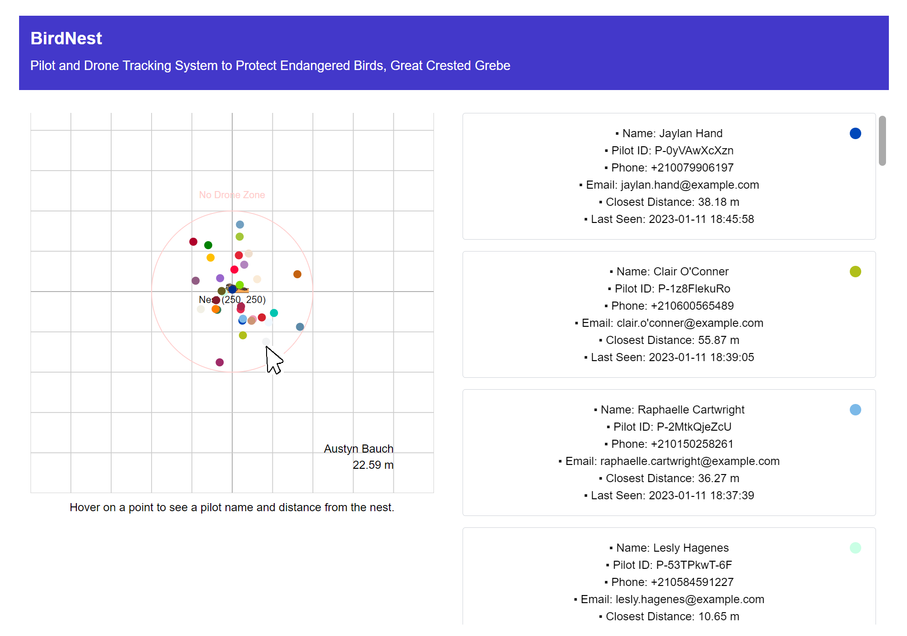
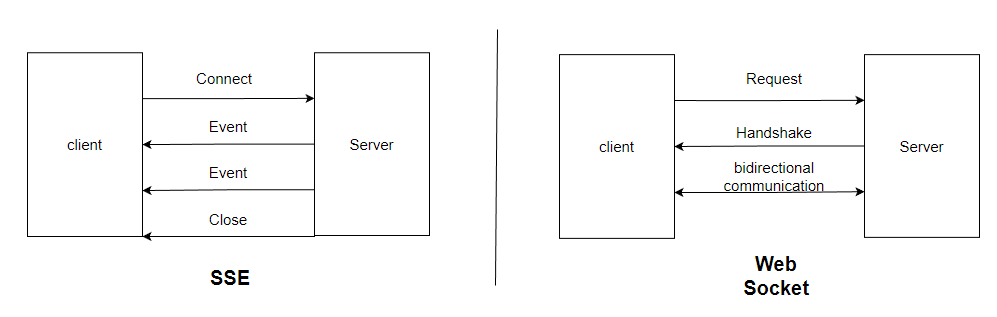
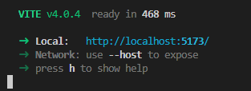

# No Drone Zone

The app is built to detect the protecting zone of the endangered birds Monadikuikka(Great Crested Grebe) from drones. When a drone infringes the no drone zone, the app displays the drone location and the pilot information.

**Check out the demo:** [http://3.84.254.90/](http://3.84.254.90/)

<p align="center">
  
</p>

## 1. Functional Requirement

- [x] Hold the pilot information for 10 minutes since their drones violated the NDZ.
- [x] Display the closest distance in records.
- [x] Show the pilot name, email address, and phone number.
- [x] Immediately show the information from the last 10 minutes as soon as the app is opend.
- [x] Present up-to-date information without refreshing the view.
- [x] Visualize the drone position.

## 2. Implementation

### 2.1 Development Process

1. Define objectives of the application.
2. Research and plan tech stacks.
3. Structure the app architecture.
4. Build up the backend and connect to the database.
5. Implement the frontend and test the React components.
6. Deploy the app using AWS-EC2.
7. Configure Nginx as a reverse proxy.

### 2.2 Streaming Data: Why Server-Sent Event(SSE) over WebSocket?

<p align="center">
  
</p>
Both methods have common in terms of **persist a connection** between the client and server. The difference is in the communication direction.

**SSE** is a **one way connection** to stream events to the frontend.([Mozila](https://developer.mozilla.org/en-US/docs/Web/API/Server-sent_events/Using_server-sent_events)). **Stock price tracing apps** are typical examples where SSE can be used. Whereas **WebSocket** is **bi-directional** communication protocol. **Chat apps** are examples where WebSockets can be implmented.

In this app, a user does not need to send any requests to the backend after loading the page. The client only gets automatic updates regarding violators from the server through HTTP connection. This is the reason that SSE was chosen for the project.

## 3. Architecture

<p align="center">
  
</p>

## 4. Tech stacks

| Category       | Technology                                                          |
| -------------- | ------------------------------------------------------------------- |
| Client         | TypeScript, React, TailwindCSS, React Testing Library, Jest, Vitest |
| Sever          | TypeScript, Node, Express, TypeORM, Nginx                           |
| Database       | AWS-RDS, MySQL                                                      |
| Cloud Platform | AWS-EC2                                                             |

## 5. Overview

### 5.1 Backend

- `config > data-source.ts`: configuration for MySQL Database.
- `controllers > dataStreamerController.ts`: logics to stream violators data
- `db > entity > Pilot.ts`: A class to set up columns in a database table.
- `lib > contants.ts`: constant variables that are used in the backend.
- `lib > dateFormatter.ts`: A function to format a date string.
- `lib > types.ts`: Define resuable types for TypeScript.
- `services > models > Drone.ts`: It checks drone's violation within the monitoring zone.
- `services > models > pilotRecordHandler.ts`: It check if violator data needs to be updated or new violator data should be created.
- `services > drone.services.ts`: Logics to handle drone data.
- `servoces > pilot.services.ts`: Logics to handle pilot data.
- `services > pilotStorage.services.ts`: Logics for CRUD operations on the database.
- `server.ts`: The main file for the backend.

### 5.2 Frontend

- `components > CoordinatePlane.tsx`: XY plane UI.
- `components > DroneMarker.tsx`: Drone location marker UI.
- `components > ViolatorItem.tsx`: Pilot information card UI.
- `components > ViolatorList.tsx`: Pilot list UI.
- `data > colors.json`: HEX codes data to use for drone marker.
- `hooks > useWindowsize`: Hook to get a inner height of screen to create a scroll for overflowing pilot cards.
- `lib > dateFormatter.ts`: Format date string.
- `lib > distanceFormatter`: Reduced decimal points of distance value.
- `lib > types.ts`: Types that widely used in the client side.
- `test`: testing codes for the client side.

### 6. Challenges

#### 6.1 AWS-EC2

Having basic knowledge in Linux commands was helpful but it was not enough to set up a virtual server in the AWS cloud. For example, it was challenging to set up **the security group for an instance**. In the future, I want to improve my understanding in network and change the current configuration.

#### 6.2 Nginx

I got to know about Nginx and **reverse proxy** through this project. In my first trial of deployment, the frontend showed the UI and the server worked properly with the database. However, the data were not streamed to the frontend.

After many hours of research, I learned about the configuration for reverse proxy was missing in my first deployment trial. After setting up the reverse proxy configuration in Nginx, the data were streamed successfully.

## 7. Improvement

- Add testing in the server side.
- Modify security group inbound rules for better security.
- When undefined data is fetched from Reaktor API, make the server work continuously without shutdown.
- Deploy the SSL certificate and switch http to https.

## 8. Run locally

### Prerequisite

- Need a AWS-RDS MySQL database.
- Need to create `.env` on the root of the server (no-drone-zone > server > .env) with following variables.
- 1. DB_HOST
- 2. DB_PORT
- 3. DB_USER
- 4. DB_PASSWORD
- 5. DB_DATABASE

### 8.1 Backend

1. In the terminal `git clone https://github.com/chepark/no-drone-zone.git`
2. In the `no-drone-zone` directory,

```
$cd server
$npm install
```

3. Run the server

```
$npm run serve
```

### 8.2 Frontend

1. In the `no-drone-zone` directory,

```
$cd client
$npm install
$npm run dev
```

2. Open the link showing in the terminal.
<p align="left">
  
</p>
