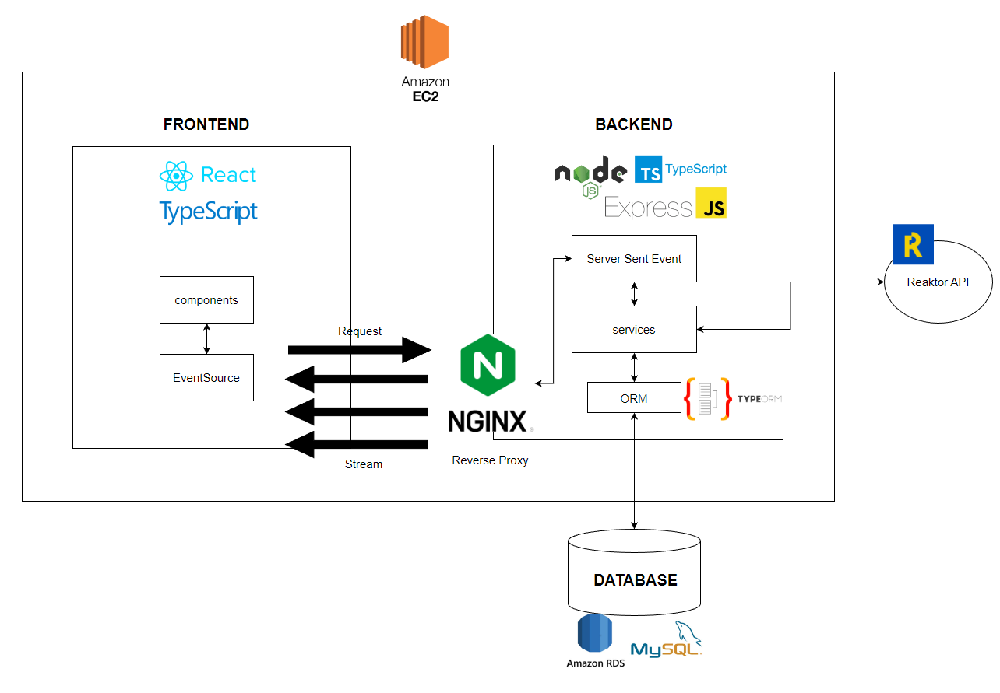

# No Drone Zone

The app is built to detect the protecting zone of the endangered birds Monadikuikka from drones. When a drone infringes the no drone zone, the app displays the drone location and the pilot information.

## 1. Functional Requirement

- [x] Hold the pilot information for 10 minutes since their drones violated the NDZ.
- [x] Display the closest distance in records.
- [x] Show the pilot name, email address, and phone number.
- [x] Immediately show the information from the last 10 minutes as soon as the app is opend.
- [x] Present up-to-date information without refreshing the view.
- [x] Visualize the drone position.

## 2. Architecture

  

## 3. Tech stacks

| Category       | Technology                                                          |
| -------------- | ------------------------------------------------------------------- |
| Client         | TypeScript, React, TailwindCSS, React Testing Library, Jest, Vitest |
| Sever          | TypeScript, Node, Express, TypeORM, Nginx                           |
| Database       | AWS-RDS, MySQL                                                      |
| Cloud Platform | AWS-EC2                                                             |

## 4. Overview

### 4.1 Backend

- `config > data-source.ts`: configuration for MySQL Database.
- `controllers > dataStreamerController.ts`: logics to stream violators data
- `db > entity > Pilot.ts`: A class to set up columns in a database table.
- `lib > contants.ts`: constant variables that are used in the backend.
- `lib > dateFormatter.ts`: A function to format a date string.
- `lib > types.ts`: Define resuable types for TypeScript.
- `services > models > Drone.ts`: It checks drone's violation within the monitoring zone.
- `services > models > pilotRecordHandler.ts`: It check if violator data needs to be updated or new violator data should be created.
- `services > drone.services.ts`: Logics to handle drone data.
- `servoces > pilot.services.ts`: Logics to handle pilot data.
- `services > pilotStorage.services.ts`: Logics for CRUD operations on the database.
- `server.ts`: The main file for the backend.

### 4.2 Frontend

- `components > CoordinatePlane.tsx`: XY plane UI.
- `components > DroneMarker.tsx`: Drone location marker UI.
- `components > ViolatorItem.tsx`: Pilot information card UI.
- `components > ViolatorList.tsx`: Pilot list UI.
- `data > colors.json`: HEX codes data to use for drone marker.
- `hooks > useWindowsize`: Hook to get a inner height of screen to create a scroll for overflowing pilot cards.
- `lib > dateFormatter.ts`: Format date string.
- `lib > distanceFormatter`: Reduced decimal points of distance value.
- `lib > types.ts`: Types that widely used in the client side.
- `test`: testing codes for the client side.

## 5. Implementation

This section explains the development process, reasons for using certain technology, and challengies along the way of the implementation.

### 5.1 Process

1. Define objectives of the application.
2. Research and plan tech stacks.
3. Structure the app architecture.
4. Build up the backend and connect to the database.
5. Implement the frontend and test the React components.
6. Deploy the app using AWS-EC2.
7. Configure Nginx as a reverse proxy.

### 5.2 Why Server Sent Event over WebSocket?

## 6. Challenges

### 6.1 AWS-EC2

### 6.2 NginX

When I first deloy the app,

## 7. Imrovement

## 2. Run locally

Steps to run this project:

1. Run `npm i` command
2. Setup database settings inside `data-source.ts` file
3. Run `npm start` command
